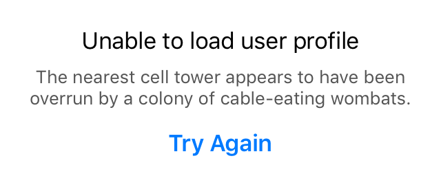

# Siesta

iOS REST Client Framework

**TL;DR**: Drastically simplifies app code by providing an observer-based model for RESTful resources.

* **OS:** iOS 8+
* **Languages:** Written in Swift, supports Swift and Objective-C
* **Build requirements:** Xcode 7 beta, Carthage
* **Status:** Pre-alpha, in active development

## What’s it for?

### The Problem

Want your app to talk to an API? Welcome to your state nightmare!

You need to display response data whenever it arrives, unless the requesting ViewController is no longer visible, unless some other currently visible ViewController happens to want the same data. You should show a loading indicator, display user-friendly errors (but no modal alert dogpiles!), give users a retry mechanism, and hide all that when a subsequent request succeeds. Be sure to avoid redundant requests. Oh, and remember not to retain your ViewController by accident in your callback closures.

What could possibly go wrong?

### The Solution

Siesta ends this headache by providing an observable model of a RESTful resource’s state. The model answers three basic questions:

* What is the latest data for this resource, if any?
* Did the latest request result in an error?
* Is there a request in progress?

…then provides notifications whenever the answers to these questions change.

Siesta handles all the transitions and corner cases to deliver these answers wrapped up with a pretty bow on top, letting you focus on your UI.

## Design Philosophy

* Make the default thing usually be the right thing.
* Make the right thing easy all of the time.
* Make client code easy to read. Provide convenices.
* Build from need. Don’t invent solutions in search of problems.
* Eliminate boilerplate.

## Features

- [x] Decouples UI state from network request state
- [x] Observer model eliminates complex, error-prone state tracking logic
- [x] Coordinates requests and data sharing across ViewControllers
- [x] Eliminates redundant network requests
- [x] Unified reporting for connection errors, server errors, and client-side parsing errors
- [x] Transparent Etag / If-Modified-Since handling
- [x] Painless built-in response parsing for JSON and plain text
- [x] Customizable response transformation
- [x] Prebaked UI components for error overlay
- [x] Use with both Swift and Objective-C
- [ ] Intelligent progress reporting that accounts for request, latency, and response
- [ ] Prebaked progress bar UI components
- [ ] Customizable data caching
- [ ] Built-in XML parsing

---

## Usage

Create a `Service` singleton for each API your app uses:

```swift
import Siesta

class MyAPI: Service {
    static let instance = MyAPI(base: "https://api.example.com")
}
```

Your service subclass must be written in Swift. You can use it from both Objective-C and Swift code.

Retrieve `Resource` objects from the service:

```swift
MyAPI.instance.resource("/profile")
MyAPI.instance.resource("/items").child("123").child("related")
MyAPI.instance.resource("/items/123/related") // same as previous
```
```objc
[MyAPI.instance resource:@"/profile"];
[[[MyAPI.instance resource:@"/items"] child:@"123"] child:@"related"];
[MyAPI.instance resource:@"/items/123/related"]; // same as previous
```

Within the context of a `Service`, there is at most one `Resource` object for a given URL, no matter how you navigate to that URL.

You may add convenience accessors to your service for commonly used resources:

```swift
class MyAPI: Service {
    static let instance = MyAPI(base: "https://api.example.com")

    var profile: Resource { return resource("profile") }
}
```

### Requests

Resources start out empty — no data, no error, not loading. To trigger a GET request:

```swift
MyAPI.instance.profile.loadIfNeeded()
```
```objc
[MyAPI.instance.profile loadIfNeeded];
```

Don’t worry about calling `loadIfNeeded()` too often. Call it in your `viewWillAppear()`! Call it in response to touch events! Call it 50 times a second! It automatically suppresses redundant requests. (Data expiration time is configurable on a per-service and per-resource level.)

### Resource state

A resource keeps a local cache of the latest valid data:

```swift
resource.data       // Gives a string, dict/array (for JSON), NSData, or
                    // nil if no data is available. You can also configure
                    // custom data types (e.g. model objects).

resource.text       // Typed accessors return an empty string/dict/array
resource.dict       // if data is either unavailable or not of the expected
resource.array      // type. This reduces futzing with optionals.

resource.latestData // Full metadata, in case you need the gory details.
```

A resource knows whether it is currently loading, which lets you show/hide a spinner or progress bar:

```swift
resource.loading  // True if network request in progress
```

…and it knows whether the last request resulted in an error:

```swift
resource.latestError               // Present if latest load attempt failed
resource.latestError?.userMessage  // String suitable for display in UI
```

That `latestError` rolls up many different kinds of error — transport-level errors, HTTP errors, and client-side parse errors — into a single consistent structure that’s easy to wrap in a UI.

Note that data, error, and loading are not mutually exclusive. For example, consider the following scenario:

* You load a resource, and the request succeeds.
* You refresh it later, and that second request fails.
* You initiate a third request.

At this point, `loading` is true, `latestError` holds information about the previously failed request, and `data` still gives the old cached data. You can decide which of these things your UI prioritizes over the others.

### Observers

UI components can observe changes to a resource, either by implementing the `ResourceObserver` protocol (or its counterpart `ResourceObserverObjc` in Objective-C):

```swift
MyAPI.instance.profile.addObserver(self)
```
```objc
[MyAPI.instance.profile addObserver:self];
```

…or by providing an observer closure (Swift only):

```swift
MyAPI.instance.profile.addObserver(owner: self) {
    resource, event in
    …
}
```

Observers receive a notification when a resource starts loading, receives new data, or receives an error. Each observer is also pinged immediately when it first starts observing, even if the resource has not changed. This lets you put all your UI-populating code in one place.

The simplest way to implement your observer is to ignore the triggering event, and take an idempotent “update everything” approach:

```swift
func resourceChanged(resource: Resource, event: ResourceEvent) {
    // The convenience .dict accessor returns empty dict if no data,
    // so the same code can both populate and clear fields.
    let json = JSON(resource.dict)
    nameLabel.text = json["name"].string
    favoriteColorLabel.text = json["favoriteColor"].string

    if resource.loading {
        activityIndicator.startAnimating()
    } else {
        activityIndicator.stopAnimating()
    }

    errorLabel.text = resource.latestError?.userMessage
}
```

Note the pleasantly reactive flavor this code takes on — without the overhead of adopting full-on Reactive programming with captial R.

If updating the whole UI is an expensive operation (but it rarely is; benchmark first!), you can use the `event` parameter and the metadata in `latestData` and `latestError` to fine-tune your UI updates.

Note that a resource might have failed on the last request, have older valid data, _and_ have a new request in progress. Siesta does not dictate which of these take precedence in your UI. It just tells you the current state of affairs, and leaves it to you to determine how to display it. Want to always show the latest data, even if there was a more recent error? No problem. Only show a loading indicator if no data is present? You can do that.

Putting it all together:

```swift
import Siesta
import SwiftyJSON

class ProfileViewController: UIViewController, ResourceObserver {
    @IBOutlet weak var nameLabel, favoriteColorLabel: UILabel!
    @IBOutlet weak var activityIndicator: UIActivityIndicatorView!
    @IBOutlet weak var errorLabel: UILabel!

    override func viewDidLoad() {
        super.viewDidLoad()

        MyAPI.instance.profile.addObserver(self)
    }

    override func viewWillAppear(animated: Bool) {
        MyAPI.instance.profile.loadIfNeeded()
    }

    func resourceChanged(resource: Resource, event: ResourceEvent) {
        let json = JSON(resource.dict)
        nameLabel.text = json["name"].string
        favoriteColorLabel.text = json["favoriteColor"].string

        if resource.loading {
            activityIndicator.startAnimating()
        } else {
            activityIndicator.stopAnimating()
        }

        errorLabel.text = resource.latestError?.userMessage
    }
}
```

### UI Components

The code above is already easy — but the business of showing the activity indicator and error message can get repetitive. Siesta provides a status overlay view that takes care of that for you.

The overlay is designed to cover your entire content view when there is an error, by you can position it as you like. It comes with a tidy standard layout:



…and you can also provide your own custom .xib.

Using the standard overlay, the example above becomes:

```swift
class ProfileViewController: UIViewController, ResourceObserver {
    @IBOutlet weak var nameLabel, favoriteColorLabel: UILabel!
    
    let statusOverlay = ResourceStatusOverlay()

    override func viewDidLoad() {
        super.viewDidLoad()

        statusOverlay.embedIn(self)

        MyAPI.instance.profile
            .addObserver(self)
            .addObserver(statusOverlay)
    }

    override func viewDidLayoutSubviews() {
        statusOverlay.positionToCoverParent()
    }
    
    override func viewWillAppear(animated: Bool) {
        super.viewWillAppear(animated)
        MyAPI.instance.profile.loadIfNeeded()
    }

    func resourceChanged(resource: Resource, event: ResourceEvent) {
        let json = JSON(resource.dict)
        nameLabel.text = json["name"].string
        favoriteColorLabel.text = json["favoriteColor"].string
    }
}
```

Or in Objective-C:

```objc
@interface ProfileViewController: UIViewController <ResourceObserverObjc>
@property (weak,nonatomic) IBOutlet UILabel *nameLabel, *favoriteColorLabel;
@property (strong,nonatomic) ResourceStatusOverlay *statusOverlay;
@end

@implementation ProfileViewController

- (void) viewDidLoad {
    super.viewDidLoad()

    self.statusOverlay = [[[ResourceStatusOverlay alloc] init] embedIn:self];

    [[MyAPI.instance.profile
        addObserver:self]
        addObserver:statusOverlay];
}

- (void) viewDidLayoutSubviews {
    [_statusOverlay positionToCoverParent];
}

- (void) viewWillAppear: (BOOL) animated {
    [super viewWillAppear:animated];    
    [MyAPI.instance.profile loadIfNeeded];
}

- (void) resourceChanged: (Resource*) resource event: (NSString*) event {
    id json = resource.dict;
    nameLabel.text = json[@"name"];
    favoriteColorLabel.text = json[@"favoriteColor"];
}

@end
```

## Memory Management

Note that in the examples above, no code calls any sort of “removeObserver” method.